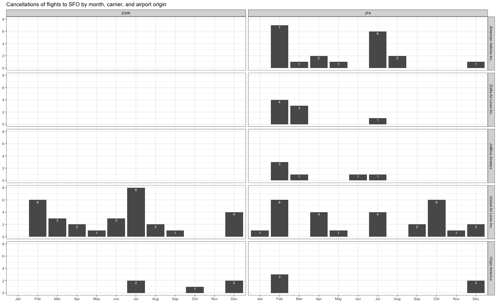

---
categories:
- ""
- ""
date: "2023-06-22"
description: Some fascinating data manipulation exercises in R
draft: false
image: analytics.jpg
keywords: ""
slug: blog4
title: Data Manipulation Exercises
---

```{r}
#| label: load-libraries
#| echo: false # This option disables the printing of code (only output is displayed).
#| message: false
#| warning: false

library(tidyverse)
library(nycflights13)
library(skimr)

```

# Data Manipulation

## Problem 1: Use logical operators to find flights that:

```         
-   Had an arrival delay of two or more hours (\> 120 minutes)
-   Flew to Houston (IAH or HOU)
-   Were operated by United (`UA`), American (`AA`), or Delta (`DL`)
-   Departed in summer (July, August, and September)
-   Arrived more than two hours late, but didn't leave late
-   Were delayed by at least an hour, but made up over 30 minutes in flight
```

```{r}
#| label: problem-1

# Had an arrival delay of two or more hours (> 120 minutes)

flights %>% 
  filter(arr_delay > 120)

# Flew to Houston (IAH or HOU)

flights %>% 
  filter(dest %in% c("IAH", "HOU"))

# Were operated by United (`UA`), American (`AA`), or Delta (`DL`)

flights %>%
  filter(carrier %in% c("UA", "AA", "DL")) 

  
  # Departed in summer (July, August, and September)
  
flights %>%
  filter(month %in% c(7, 8, 9))

# Arrived more than two hours late, but didn't leave late

x <- flights %>% filter(arr_delay > 120)
y <- flights %>% filter(dep_delay > 0)
  anti_join(x, y, by = NULL)

# Were delayed by at least an hour, but made up over 30 minutes in flight
  
a <- flights %>% filter(dep_delay > 60)
b <- flights %>% filter(arr_delay >= (dep_delay-30))
  anti_join(a, b, by = NULL)
```

## Problem 2: What months had the highest and lowest proportion of cancelled flights? Interpret any seasonal patterns. To determine if a flight was cancelled use the following code

<!-- -->

```         
flights %>% 
  filter(is.na(dep_time)) 
```

```{r}
#| label: problem-2

# What months had the highest and lowest % of cancelled flights?

# We first determine the total number of flights per month (which appear to be similar based on the results of using the code below)

total <- flights %>%
  count(month)

# We can then determine how many flights are cancelled per month using the following code.

flights %>% 
  filter(is.na(dep_time)) %>%
  count(month) 

# We can then determine what is the proportion of flights (in percent) that are cancelled per month using the following code:

flights %>% 
  filter(is.na(dep_time)) %>%
  count(month)/(total)*100 
  
#The tibble from this code classifies the number of cancelled flights into monthly groups. Thereby, the minimum and maximum proportion of flights cancelled in a given month is 1.64 percent (for November) and 5.05 percent (for February), respectively. This stands to reason because February will see a lot of cancellations due to snow (noting that many US airlines are included in the data and that the US is such a massive hub for so many flights globally). November sees fewest cancellations presumably because the weather has yet to become bad in the US or the UK (London and Frankfurt and Amsterdam are major European global hubs). In addition, there will be a particularly large incentive for people in the USA to reach home for Thanksgiving in November and airlines will be under pressure to see that customers needs are met.


```

## Problem 3: What plane (specified by the `tailnum` variable) traveled the most times from New York City airports in 2013? Please `left_join()` the resulting table with the table `planes` (also included in the `nycflights13` package).

For the plane with the greatest number of flights and that had more than 50 seats, please create a table where it flew to during 2013.

```{r}

#check that all outbound flights originate from one of the three new york city airports, JFK (John F Kennedy), LGA (La Guardia), EWR (Newark). This appears to be the case by eye when spot checking but one needs to check this first systematically. I do this by asking for a tibble for all flights (which reveals 336,776 rows i.e. total number of flights) and then filtering for the aforementioned three airports alone and this also produces a title with 336,776 rows. Thus, I can confirm that the origin attribute is synonymous with the total number of flights departing from a new york city.

flights

flights %>%
  filter(origin %in% c("JFK", "LGA", "EWR")) 

# I then filter for the year 2013, and count the number of flights involving each plane count(tailnum) and then arrange this number, n, in descending order. This reveals the plane that has taken the most flights in 2013.
 
flights %>% 
  filter(year == 2013) %>%
  count(tailnum) %>%
  arrange(desc(n))

# The plane with tailnumber N725MQ has taken the most (575) flights in 2013. Note that the top entry is 'NA' i.e. not applicable entries, rather than actual flights as departures need to have reference tail numbers.

#We now filter further on the plane that has taken the most flights in 2013 that also has > 50 seats. 

planes %>%
  filter(seats > 50)

# This reveals that there are 3200 planes with > 50 seats.

# We now determine which plane has the greatest number of flights which has more than 50 seats.

left_join(flights, planes, by = 'tailnum') %>%
  filter(year.x == 2013, seats > 50) %>%
  count(tailnum) %>%
  arrange(desc(n))

#We now create a table where this plane (N328AA) flew to during 2013 on its 393 flights.

left_join(flights, planes, by = 'tailnum') %>%
  filter(tailnum == 'N328AA') %>%
  summarise(tailnum,dest)

```

## Problem 4: The `nycflights13` package includes a table (`weather`) that describes the weather during 2013. Use that table to answer the following questions:

```         
-   What is the distribution of temperature (`temp`) in July 2013? Identify any important outliers in terms of the `wind_speed` variable.
-   What is the relationship between `dewp` and `humid`?
-   What is the relationship between `precip` and `visib`?
```

```{r}
#We first look at the distribution of the temperature in July using a heatmap of each hour in each day in July with the colour representing temperature:

library(ggplot2)

july <- weather %>% filter (month == 7)
  ggplot(data = july, mapping = aes(x = day, y = hour, fill = temp)) + geom_tile()

#This heatmap shows that the hottest period of July was from 14-16 h on 19th July.

#We then check the distribution of wind_speed over the July period. 

  ggplot(data = july, mapping = aes(x = hour, y = wind_speed)) + geom_point()

# This shows that there are no obvious data outliers. The data make sense in that the max wind_speed occurs the day after 19 July which experienced the hottest temperature; and that this wind_speed then falls of back to similar values to others. There were a few 'NA' (not applicable) data points, so I removed them and then calculated the exact max wind speed:

weather %>%
  filter (month == 7) %>%
  summarise(maxwind_speed = max(wind_speed))

# This shows that the max wind speed has a value of 25.31716 (I assume Celsius although we don't appear to be told of the units!). 

# I now look at the relationship between dewp and humid:

 ggplot(data = weather, mapping = aes(x = dewp, y = humid, colour = temp)) + geom_point()

# This shows that there is a monotonic relationship between dewp and humid whereby a greater dewp tends to indicate an upward increase in humid, but that the relationship is moderate.

#Furthermore, lower dewp and higher humid leads a higher temperature. This is a stronger correlation and can be best seen on a less dense data map. So, I select July data only to show this more clearly:
  
july <- weather %>% filter (month == 7)
  ggplot(data = july, mapping = aes(x = dewp, y = humid, colour = temp)) + geom_point()
  
#I now explore the relationship between 'precip' and 'visib'
  
   ggplot(data = weather, mapping = aes(x = precip, y = visib, colour = temp)) + geom_point()
  
# There does not seem to be any real correlation between these two variables. The only observation that may be worth mentioning is that values with precip greater than about 25 tend to show high variation. Looking a bit closer at the data above this threshold:

precip25 <- weather %>%
     filter (precip > 0.25)
  
   
   ggplot(data = precip25, mapping = aes(x = precip, y = visib, colour = temp)) + geom_point()

# There is still no obvious relationship between precip and visib, which one might find a bit surprising because precipiation might be assumed to reduce visibility. But perhaps other weather conditions need to be considered as being more influencial.   
   
   
```

## Problem 5: Use the `flights` and `planes` tables to answer the following questions:

```         
-   How many planes have a missing date of manufacture?
-   What are the five most common manufacturers?
-   Has the distribution of manufacturer changed over time as reflected by the airplanes flying from NYC in 2013? (Hint: you may need to use case_when() to recode the manufacturer name and collapse rare vendors into a category called Other.)
```

```{r}
#A rendering of planes will afford the total number of rows of manufacturer dates (year):

planes

#The tibble matrix 3,322 x 9 shows that there are 3,322 manufacturer year records. We now compute how many have a missing date:

planes %>%
  filter (!is.na(year))

#This gives a tibble matrix size of 3252 x 9. Thus, the number of missing manufacturer year dates is 3322-3252 = 70. 

#Now determining the five most common plane manufacturers:

#manufacturers <- planes %>%
  #group_by(manufacturer)
planes %>% 
  count(manufacturer) %>%
  arrange(desc(n)) 

# This suggests that the five most common plane manufacturers (and their number) are:
#BOEING	(1630)			
#AIRBUS INDUSTRIE	(400)			
#BOMBARDIER INC	(368)			
#AIRBUS	(336)			
#EMBRAER	(299)	

#However, several of these manufacturers are actually the same company, so one needs to combine some of them to make the final version of the five most common plane manfacturers. 


planes <- planes %>%
   mutate(recode_manufacturer  = case_when(
     manufacturer %in% c("BOEING") ~ "Boeing",
     manufacturer %in% c("AIRBUS INDUSTRIE", "AIRBUS") ~ "Airbus",
     manufacturer %in% c("EMBRAER") ~ "Embraer",
     manufacturer %in% c("MCDONNELL DOUGLAS", "MCDONNELL DOUGLAS AIRCRAFT CO", "MCDONNELL DOUGLAS CORPORATION" ) ~ "McDonnell Douglas",
     TRUE ~ "Other"
   ))

#This affords:

#Boeing (1630)
#Airbus (400+336 = 736)
#Bombardier (368)
#Embraer (299)
#McDonnell Douglas (120+103+4 = 227)


#Now plotting the distribution of plane manufacturers over time, using the span of 2013 as a snapshot of that year's distribution, to see how they have changed:

  

flights %>% 
  left_join(planes, by = "tailnum")%>% 
  group_by(month, recode_manufacturer) %>% 
  summarise (n = n()) %>% 
  drop_na(recode_manufacturer) %>% 
  mutate(percent = n/ sum(n)) %>% 

  ggplot() +
  aes(x = month, y = n, colour = recode_manufacturer)+
  geom_line()+
  theme_light()


```

## Problem 6: Use the `flights` and `planes` tables to answer the following questions:

```         
-   What is the oldest plane (specified by the tailnum variable) that flew from New York City airports in 2013?
-   How many airplanes that flew from New York City are included in the planes table?
```

```{r}
left_join(flights, planes, by = 'tailnum') %>%
  filter (!is.na(year.y)) %>%
  summarise(maxage = min(year.y)) 

#This shows that the oldest plane in service from NYC flights in 2013 is from 1956.

#I then determine how many planes that flew from NYC in 2013 (which I define as those having a valid arrival time) are included in the plane table using:

left_join(flights, planes, by = 'tailnum') %>%
  filter (!is.na(arr_time)) %>%
  count(tailnum) %>%
  arrange(desc(n))

#This produces a tibble of 4037 x 2. 

#i.e. there are 4037 planes that meet this condition.

```

## Problem 7: Use the `nycflights13` to answer the following questions:

```         
-   What is the median arrival delay on a month-by-month basis in each airport?
-   For each airline, plot the median arrival delay for each month and origin airport.
```

```{r}

#I calculate the median value of the arr_delay variable for each month of the NYC flights data from 2013. This affords the following code and table:

flights %>%
  filter (!is.na(arr_delay)) %>%
  group_by(month, origin) %>%
  summarise(medianarrdelay = median(arr_delay)) 

#   For each airline, I now plot the median arrival delay for each month and origin airport.

flights %>%
  filter (!is.na(arr_delay)) %>%
  group_by(month, origin, carrier) %>%
  summarise(medianarrdelay = median(arr_delay)) %>%
  
    ggplot() + (aes(x = month, y = medianarrdelay, colour = origin)) + geom_line() + facet_wrap(vars(carrier), scales = 'free') 
```

## Problem 8: Let's take a closer look at what carriers service the route to San Francisco International (SFO). Join the `flights` and `airlines` tables and count which airlines flew the most to SFO. Produce a new dataframe, `fly_into_sfo` that contains three variables: the `name` of the airline, e.g., `United Air Lines Inc.` not `UA`, the count (number) of times it flew to SFO, and the `percent` of the trips that that particular airline flew to SFO.

```{r}
# Joining the flights and airlines tables
fly_into_sfo <- left_join(flights, airlines, by = "carrier") %>%
# counting which airlines flew the most to SFO, and then showning their relative proportion (percent) that flew to SFO.
  filter(dest == "SFO") %>%
  count(name) %>%
  arrange(desc(n)) %>%
  mutate(percent = 100*n/sum(n))

#printing the resulting data frame as an output table:

fly_into_sfo

# providing a total of the number of flights that flew from NYC to SFO in 2013.

fly_into_sfo %>%
  summarise(n=sum(n))

# The table generated shows that five airlines flew to SFO from NYC during 2013, and the airline, United Air Lines, Inc., flew most times to SFO from NYC during 2013, to the tune of 6819 flights. This compares with the total number of flights from NYC to SFO which was 13331. i.e. United Air Lines Inc represents 51.15 percent (= (6819/13331) x 100) of the total number of flights from NYC to SFO in 2013.
```

And here is some bonus ggplot code to plot your dataframe

```{r}
#| label: ggplot-flights-toSFO
#| message: false
#| warning: false

fly_into_sfo %>% 

  # sort 'name' of airline by the numbers it times to flew to SFO
  mutate(name = fct_reorder(name, n)) %>% 
  ggplot() +
  
  aes(x = n, 
      y = name, ) +
  
  # a simple bar/column plot
  geom_col() +
  
  # add labels, so each bar shows the % of total flights 
  geom_text(aes(label = percent),
             hjust = 1, 
             colour = "grey", 
             size = 4)+
  
  # add labels to help our audience  
  labs(title="Which airline dominates the NYC to SFO route?", 
       subtitle = "as % of total flights in 2013",
       x= "Number of flights",
       y= NULL) +
  
  theme_minimal() + 
  
  # change the theme-- i just googled those , but you can use the ggThemeAssist add-in
  # https://cran.r-project.org/web/packages/ggThemeAssist/index.html
  
  theme(#
    # so title is left-aligned
    plot.title.position = "plot",
    
    # text in axes appears larger        
    axis.text = element_text(size=12),
    
    # title text is bigger
    plot.title = element_text(size=16)
      ) +

  # add one final layer of NULL, so if you comment out any lines
  # you never end up with a hanging `+` that awaits another ggplot layer
  NULL
 
 
 
 
```

## Problem 9: Let's take a look at cancellations of flights to SFO. We create a new dataframe `cancellations` as follows

```{r}

cancellations <- flights %>% 
  
  # just filter for destination == 'SFO'
  filter(dest == 'SFO') %>% 
  
  # a cancelled flight is one with no `dep_time` 
  filter(is.na(dep_time))

#I have written the code below to show how to emulate the graph that has been provided us. This seemed to be the best way of explaining it. I have inserted comments within to show my workings.

#First, assemble the data that I need in a common place (via a left_join using the carrier as a common variable) and install the right grouping for the graph that was provided to us.
airlines %>%
left_join(cancellations,airlines,by="carrier")%>%
  filter(!is.na(origin)) %>%
  group_by(origin,name) %>%

# plot the data in the format required. The facet_grid option allows us to specify which grouping above goes on the rows and columns. I have then described the x values as discrete (chars not numerics) and I have tried to label the x values (not the axis) on the graph although they don't appear to show up (I tried using month.abb and month.name options before trying this explicit labelling). I request that the x and y axes are not labelled, but that the plot title is given in a suitably modest font. I then add the values of the counts on the bars themselves as an annotation. All of these things combined tend to emulate the graph that we were given.
  
  ggplot(mapping = aes(x=month)) +
    geom_bar() +
    facet_grid(rows = vars(name), cols = vars(origin))+
scale_x_discrete(breaks = 1:12, labels=c("Jan","Feb","Mar","Apr","May","Jun","Jul","Aug","Sep","Oct","Nov","Dec")) + xlab(NULL) + ylab(NULL) +
 labs(title = 'Cancellations at SFO by month, origin and airline') +  
  theme(plot.title = element_text(size = 12)
        ) +  geom_text(stat = 'count', aes(label = after_stat(count), vjust = 1,colour = "white", size = 2)) + theme(legend.position="none")
```

I want you to think how we would organise our data manipulation to create the following plot. No need to write the code, just explain in words how you would go about it.



## Problem 10: On your own -- Hollywood Age Gap

The website <https://hollywoodagegap.com> is a record of *THE AGE DIFFERENCE IN YEARS BETWEEN MOVIE LOVE INTERESTS*. This is an informational site showing the age gap between movie love interests and the data follows certain rules:

-   The two (or more) actors play actual love interests (not just friends, coworkers, or some other non-romantic type of relationship)
-   The youngest of the two actors is at least 17 years old
-   No animated characters

The age gaps dataset includes "gender" columns, which always contain the values "man" or "woman". These values appear to indicate how the characters in each film identify and some of these values do not match how the actor identifies. We apologize if any characters are misgendered in the data!

The following is a data dictionary of the variables used

| variable            | class     | description                                                                                             |
|:---------------|:---------------|:---------------------------------------|
| movie_name          | character | Name of the film                                                                                        |
| release_year        | integer   | Release year                                                                                            |
| director            | character | Director of the film                                                                                    |
| age_difference      | integer   | Age difference between the characters in whole years                                                    |
| couple_number       | integer   | An identifier for the couple in case multiple couples are listed for this film                          |
| actor_1\_name       | character | The name of the older actor in this couple                                                              |
| actor_2\_name       | character | The name of the younger actor in this couple                                                            |
| character_1\_gender | character | The gender of the older character, as identified by the person who submitted the data for this couple   |
| character_2\_gender | character | The gender of the younger character, as identified by the person who submitted the data for this couple |
| actor_1\_birthdate  | date      | The birthdate of the older member of the couple                                                         |
| actor_2\_birthdate  | date      | The birthdate of the younger member of the couple                                                       |
| actor_1\_age        | integer   | The age of the older actor when the film was released                                                   |
| actor_2\_age        | integer   | The age of the younger actor when the film was released                                                 |

How would you explore this data set? Here are some ideas of tables/ graphs to help you with your analysis

-   How is `age_difference` distributed? What's the 'typical' `age_difference` in movies?

-   The `half plus seven\` rule. Large age disparities in relationships carry certain stigmas. One popular rule of thumb is the [half-your-age-plus-seven](https://en.wikipedia.org/wiki/Age_disparity_in_sexual_relationships#The_.22half-your-age-plus-seven.22_rule) rule. This rule states you should never date anyone under half your age plus seven, establishing a minimum boundary on whom one can date. In order for a dating relationship to be acceptable under this rule, your partner's age must be:

$$\frac{\text{Your age}}{2} + 7 \< \text{Partner Age} \< (\text{Your age} - 7) \* 2$$ How frequently does this rule apply in this dataset?

-   Which movie has the greatest number of love interests?
-   Which actors/ actresses have the greatest number of love interests in this dataset?
-   Is the mean/median age difference staying constant over the years (1935 - 2022)?
-   How frequently does Hollywood depict same-gender love interests?


```{r}

age_gaps <- readr::read_csv('https://raw.githubusercontent.com/rfordatascience/tidytuesday/master/data/2023/2023-02-14/age_gaps.csv')

#1. How is `age_difference` distributed? 

ggplot(data = age_gaps, mapping = aes(age_difference)) + geom_histogram() 


#2. What's the 'typical' `age_difference` in movies?

ggplot(data = age_gaps, mapping = aes(age_difference)) + geom_boxplot() 


#3. Which movie has the greatest no. of love interests?
#

#I first look at the distribution of couple_number:
age_gaps %>%
  count(couple_number)
#This reveals that there is only one movie with 7 love interests. So I filter the dataset on this number:
age_gaps %>%
  filter(couple_number == 7) 

#The result is a dataframe that identifies the movie as Love Actually.


#4. Which actors/ actresses have the greatest number of love interests in this dataset?

#There are far too many actors to compare via a distribution. So, the best thing to do is to identify which male and female actors appear more frequently in the dataset. I selected actors who have a frequency down to 6. This means that I need the top 30 number of times that a male actor is in a couple for a movie and the top 20 number of times that a female actor is in a couple for a movie. This selection also resulted in a nearly equal number of male (33) and female (31) actors to compare. See:

actor1 <- age_gaps %>%
  count(actor_1_name) %>%
  arrange(desc(n)) %>%
  top_n(30) 
actor1
 

actor2 <- age_gaps %>%
  count(actor_2_name) %>%
  arrange(desc(n)) %>%
  top_n(20) 
actor2

#Thus, Keanu Reeves is the actors with the greatest number (24) of love interests. There are two actresses, Keira Knightley and Scarlet Johannsen, who equally register the highest (13) number of love interests.

#5. Is the age difference staying constant over the years (1935 - 2022)?

  ggplot(data = age_gaps, mapping = aes(release_year,age_difference)) + geom_point()

# This plot shows that the variance in age difference is decreasing with increasing year (of movie release), and there are more data at the greater age differences at the more recent years. Thus, this suggests a trend towards greater coupling up greater age differences and a greater range of age differences.  

#  6.How frequently does Hollywood depict same-gender love interests?
  age_gaps%>%
    count(character_1_gender,character_2_gender)
  
#This table shows that same-gender love interests appear 11 times in male-male and 12 times in female-female liaisons. The total number of options is 1155, so the depiction of same-gender love interests occurs about 1 percent of the time.
```

```{r}

```

