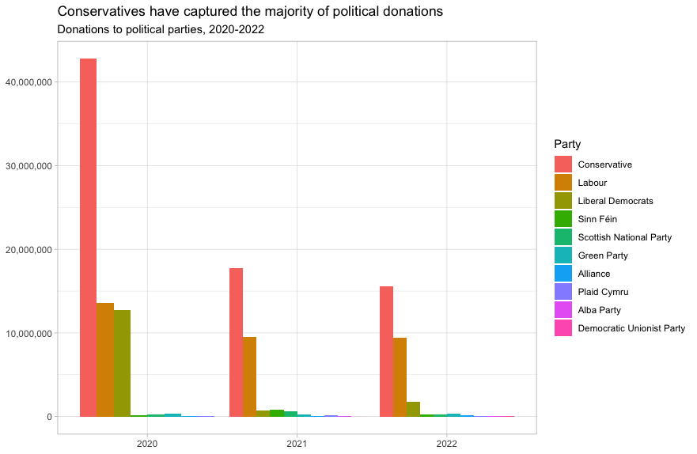

---
categories:
- ""
- ""
date: "2023-06-22"
description: Creating and Using Databases with R
draft: false
image: databases.jpg
keywords: ""
slug: bloge
title: Database Exercises
---


# Money in UK politics

[The Westminster Accounts](https://news.sky.com/story/the-westminster-accounts-12786091), a recent collaboration between Sky News and Tortoise Media, examines the flow of money through UK politics. It does so by combining data from three key sources:

1.  [Register of Members' Financial Interests](https://www.parliament.uk/mps-lords-and-offices/standards-and-financial-interests/parliamentary-commissioner-for-standards/registers-of-interests/register-of-members-financial-interests/),
2.  [Electoral Commission records of donations to parties](http://search.electoralcommission.org.uk/English/Search/Donations), and
3.  [Register of All-Party Parliamentary Groups](https://www.parliament.uk/mps-lords-and-offices/standards-and-financial-interests/parliamentary-commissioner-for-standards/registers-of-interests/register-of-all-party-party-parliamentary-groups/).

You can [search and explore the results](https://news.sky.com/story/westminster-accounts-search-for-your-mp-or-enter-your-full-postcode-12771627) through the collaboration's interactive database. Simon Willison [has extracted a database](https://til.simonwillison.net/shot-scraper/scraping-flourish) and this is what we will be working with. If you want to read more about [the project's methodology](https://www.tortoisemedia.com/2023/01/08/the-westminster-accounts-methodology/).

## Open a connection to the database

The database made available by Simon Willison is an `SQLite` database


```r
sky_westminster <- DBI::dbConnect(
  drv = RSQLite::SQLite(),
  dbname = here::here("data", "sky-westminster-files.db")
)
```

How many tables does the database have?


```r
DBI::dbListTables(sky_westminster)
```

```
## [1] "appg_donations"  "appgs"           "member_appgs"    "members"        
## [5] "parties"         "party_donations" "payments"
```

```r
# The database has 7 tables according to the results of running this DBI request.
```

## Which MP has received the most amount of money?

You need to work with the `payments` and `members` tables and for now we just want the total among all years. To insert a new, blank chunk of code where you can write your beautiful code (and comments!), please use the following shortcut: `Ctrl + Alt + I` (Windows) or `cmd + option + I` (mac)


```r
# Read in the relevant tables as dataframes

payments <-  dplyr::tbl(sky_westminster, "payments")
members <-  dplyr::tbl(sky_westminster, "members")
parties <-  dplyr::tbl(sky_westminster, "parties")

#calculate which MP has received the most money

payments %>% 
  group_by(member_id) %>%
  summarise(maxvalue = sum(value)) %>%
  left_join(members, by = c("member_id" = "id")) %>% #joint payments and members with the common MP id to resolve the identity of the MPs.
  arrange(desc(maxvalue)) # arrange dataframe in descending value.
```

```
## Warning: Missing values are always removed in SQL aggregation functions.
## Use `na.rm = TRUE` to silence this warning
## This warning is displayed once every 8 hours.
```

```
## # Source:     SQL [?? x 8]
## # Database:   sqlite 3.41.2 [C:\Users\jcole\dsb2023\website1\data\sky-westminster-files.db]
## # Ordered by: desc(maxvalue)
##    member_id maxvalue name        gender constituency party_id short_name status
##    <chr>        <dbl> <chr>       <chr>  <chr>        <chr>    <chr>      <chr> 
##  1 m8        2809765. Theresa May F      Maidenhead   p4       Mrs May    active
##  2 m1508     2191387. Sir Geoffr… M      Torridge an… p4       Sir Geoff… active
##  3 m1423     1282402  Boris John… M      Uxbridge an… p4       Mr Johnson active
##  4 m4514      799936. Keir Starm… M      Holborn and… p15      Mr Starmer active
##  5 m1211      769373. Andrew Mit… M      Sutton Cold… p4       Mr Mitche… active
##  6 m3958      712321. Fiona Bruce F      Congleton    p4       Ms Bruce   active
##  7 m14        692438. John Redwo… M      Wokingham    p4       Mr Redwood active
##  8 m4483      546043  Rishi Sunak M      Richmond (Y… p4       Mr Sunak   active
##  9 m4097      538678. Liz Truss   F      South West … p4       Ms Truss   active
## 10 m188       441681. Ed Davey    M      Kingston an… p17      Mr Davey   active
## # ℹ more rows
```

```r
# The MP to receive the most money is now in the top row of the resulting table, i.e. it is Teresa May who receives £2809765.42.
```

## Any `entity` that accounts for more than 5% of all donations?

Is there any `entity` whose donations account for more than 5% of the total payments given to MPs over the 2020-2022 interval? Who are they and who did they give money to?


```r
# Read in the relevant tables as dataframes

payments <-  dplyr::tbl(sky_westminster, "payments")
members <-  dplyr::tbl(sky_westminster, "members")

#First define and apply the range of year restriction

payments %>%
  
#capture the last 4 chars of the date variable as these contain the year in xxxx format. 
  
  mutate(year = str_sub(date, -4)) %>% 
  
#specify the year range 2020-2022 (note that the years only go up to 2022 so this is all that is necessary)  
  
  filter(year >= 2020) %>% 
  
#Now calculate the total value of all payments from entity (donor) to  member_ids (MPs). One needs to group and then ungroup so that this does not restrict the code that follows.
  
  group_by(entity,member_id) %>% 
  summarise(total = sum(value)) %>%
  ungroup %>%

#Now resolve the identity of the member_id by joining to the dataframe for members which contains the name of the MPs which we can link to their id which is equivalent to member_id in the dataframe for payments.
  
  left_join(members, by = c("member_id" = "id")) %>%

#Now arrange the values in descending order and collect to that one can see if any donors have given more than 5 percent of the total payments.
  
    arrange(desc(total)) %>%
  collect() %>%

#Remove two rogue rows of data that contain errors.  

  filter(!str_detect(entity, 'Country Foods'))  %>%
  filter(!str_detect(entity, 'George Watson'))  %>%

#Calculate the percentage mentioned above.
  
  mutate(percent=round(100*total/sum(total),digits=2)) %>%
  
#Select the columns of interest and show the results in a table.  

  select(entity,name,party_id,total,percent)
```

```
## `summarise()` has grouped output by "entity". You can override using the
## `.groups` argument.
```

```
## # A tibble: 4,090 × 5
##    entity                                name            party_id  total percent
##    <chr>                                 <chr>           <chr>     <dbl>   <dbl>
##  1 Withers LLP                           Sir Geoffrey C… p4       1.81e6    5.26
##  2 Fiona Bruce and Co LLP                Fiona Bruce     p4       7.12e5    2.06
##  3 Charles Stanley                       John Redwood    p4       6.75e5    1.96
##  4 Cambridge Speaker Series              Theresa May     p4       4.08e5    1.18
##  5 Centerview Partners LLP               Boris Johnson   p4       2.78e5    0.81
##  6 Council of Insurance Agents & Brokers Boris Johnson   p4       2.76e5    0.8 
##  7 Hindustan Times                       Boris Johnson   p4       2.62e5    0.76
##  8 Unite                                 Rebecca Long-B… p15      2.49e5    0.72
##  9 Emerging Asset Management             Sir Bill Wiggin p4       2.32e5    0.67
## 10 Hutchison Ports Europe                Chris Grayling  p4       2.24e5    0.65
## # ℹ 4,080 more rows
```

```r
# The results in the table reveal that one entity accounts for more than 5 percent of all donations. The entity in question is WithersLLP who donate to the Conservative MP (party_id = p4), Sir Geoffrey Cox (name) a total value of 1,812,731.81 which is 5.26 percent of the total amount of donations.
```

## Do `entity` donors give to a single party or not?

-   How many distinct entities who paid money to MPS are there?


```r
#Read in the relevant data table into a dataframe

payments <-  dplyr::tbl(sky_westminster, "payments")

payments %>%
  summarise(Unique_Elements = n_distinct(entity)) # Now summarise with unique elements 
```

```
## # Source:   SQL [1 x 1]
## # Database: sqlite 3.41.2 [C:\Users\jcole\dsb2023\website1\data\sky-westminster-files.db]
##   Unique_Elements
##             <int>
## 1            2213
```

```r
payments %>%
  summarise(Unique_Elements = n_distinct(member_id)) # Now summarise with unique elements 
```

```
## # Source:   SQL [1 x 1]
## # Database: sqlite 3.41.2 [C:\Users\jcole\dsb2023\website1\data\sky-westminster-files.db]
##   Unique_Elements
##             <int>
## 1             595
```

```r
#These results indicate that there are 2213 distinct entity (donors) and only 595 distinct member_id (MPs).
```

-   How many (as a number and %) donated to MPs belonging to a single party only?

    
    ```r
    # First convert the database tables into dataframes
    
    payments <-  dplyr::tbl(sky_westminster, "payments")
    parties <-  dplyr::tbl(sky_westminster, "parties")
    members <-  dplyr::tbl(sky_westminster, "members")
    
    # Then stitch together the columns of three dataframes where they are sequentially joined by the id of the MP or party name. 
    
    mempay <- payments %>%
      left_join(members, by = c("member_id" = "id")) 
    
    parmempay <- mempay %>%
      left_join(parties, by = c("party_id" = "id"))
    
    # Checking the result:
    
    parmempay %>%
      glimpse
    ```
    
    ```
    ## Rows: ??
    ## Columns: 23
    ## Database: sqlite 3.41.2 [C:\Users\jcole\dsb2023\website1\data\sky-westminster-files.db]
    ## $ category             <chr> "4. Visits outside the UK", "2. (b) Any other sup…
    ## $ category_name        <chr> "Gifts and other benefits", "Cash donations", "Gi…
    ## $ charity              <chr> "", "", "", "", "", "", "", "", "", "", "", "", "…
    ## $ date                 <chr> "Registered in November 2021", "Registered in Jan…
    ## $ date_visited         <chr> "Dates of visit: 5-12 November 2021", "", "Dates …
    ## $ description          <chr> "International flights £805.07; accommodation £1,…
    ## $ destination_of_visit <chr> "Accra, Ghana", "", "Kingston, Jamaica", "", "", …
    ## $ entity               <chr> "GUBA Foundation", "Mahir Kilic", "People's Natio…
    ## $ hours                <chr> "", "", "", "", "", "", "", "", "", "", "", "", "…
    ## $ id                   <chr> "44a5c7f837d9df230b8c1e7f72eea188", "b9f40bd69ac2…
    ## $ member_id            <chr> "m172", "m172", "m172", "m172", "m172", "m44", "m…
    ## $ purpose_of_visit     <chr> "To participate in the GUBA Foundation Yaa Asante…
    ## $ value                <dbl> 2631.51, 2000.00, 2574.57, 2000.00, 500.00, 1800.…
    ## $ name.x               <chr> "Diane Abbott", "Diane Abbott", "Diane Abbott", "…
    ## $ gender               <chr> "F", "F", "F", "F", "F", "M", "M", "M", "M", "M",…
    ## $ constituency         <chr> "Hackney North and Stoke Newington", "Hackney Nor…
    ## $ party_id             <chr> "p15", "p15", "p15", "p15", "p15", "p4", "p4", "p…
    ## $ short_name           <chr> "Ms Abbott", "Ms Abbott", "Ms Abbott", "Ms Abbott…
    ## $ status               <chr> "active", "active", "active", "active", "active",…
    ## $ abbrev               <chr> "Lab", "Lab", "Lab", "Lab", "Lab", "Con", "Con", …
    ## $ background           <chr> "ff0000", "ff0000", "ff0000", "ff0000", "ff0000",…
    ## $ foreground           <chr> "ffffff", "ffffff", "ffffff", "ffffff", "ffffff",…
    ## $ name.y               <chr> "Labour", "Labour", "Labour", "Labour", "Labour",…
    ```
    
    ```r
    # This puts together the three key columns that need to be compared which are entity and abbrev and member_id. Now we can calculate how many entity donate to MPs belonging to only a single party:
    #
    # First, we determine how many party_id and abbrev are distinct:
    #
    parmempay %>%
          summarise(Unique_Elements = n_distinct(party_id)) # Now     
    ```
    
    ```
    ## # Source:   SQL [1 x 1]
    ## # Database: sqlite 3.41.2 [C:\Users\jcole\dsb2023\website1\data\sky-westminster-files.db]
    ##   Unique_Elements
    ##             <int>
    ## 1              13
    ```
    
    ```r
    #     summarise with unique elements 
    
    parmempay %>%
          summarise(Unique_Elements = n_distinct(member_id)) # Now     
    ```
    
    ```
    ## # Source:   SQL [1 x 1]
    ## # Database: sqlite 3.41.2 [C:\Users\jcole\dsb2023\website1\data\sky-westminster-files.db]
    ##   Unique_Elements
    ##             <int>
    ## 1             595
    ```
    
    ```r
    #     summarise with unique elements 
    
    #These results show that there are only 13 distinct party_ids and only 13 distinct parties. Since each member_id has a particular party_id, and we expect an MP to be a member of only one party, this makes sense. But this isn't proof about the link between member_id and party_id uniqueness as a correlation. It's just an indication. So, the following code and analysis was undertaken to prove this:
    
    #Read back in my merged dataframe containing all the relevant columns and collect data from the database 
    parmempay %>%
      collect() %>%
      
    # Filter out two rows with these two lines of codes. These rows were found to contain errors when running this segment of code without them, and the nature of the code errors uncovered the text entry inconsistencies in these two rows. So, these two lines of code were added to find and remove these two rows: 
      
      filter(!str_detect(entity, 'Andrew Taylor'))  %>%
      filter(!str_detect(entity, 'Le Manoir aux Quat'))  %>%
    
    # The three relevant columns were then selected, where their relationships may be deduced counting how many rows they have in common, as this tells us to what extent these variables map to each other with a one-to-one correpondence and are thus distinct, or whether there is multiplicity in intervariable mapping. 
      
        select(entity,member_id,abbrev) %>%
      group_by(entity,member_id,abbrev) %>%
    
    # First, we group together all three variables and by just looking at the size of the tibble i.e. y where tibble has dimensions of y x 3, y reveals the number of possible combinations of each variable. Considering all three together gives us a base line (y = 4090). We then have to ungroup this group in order to do the next relationship test and continuing to add code that groups other variables:
      
      ungroup %>%
      
    # I now group member_id and abbrev to check the indication made above that all MPs will be loyal to a single party. We know from the previous question that there are 595 distinct MPs in this dataframe so if the possible combinations (mapping) of MPs and party types is the same (i.e. 595) then they have a one-to-one correspondence, and this proofs the indication above. Let's see - we now group - check the dimension, y, of the tibble that the grouping generates via this R code and then compares it against the number of distinct 595 MPs:
      
      group_by(member_id,abbrev) %>% #proof that MPs stick to one party
      ungroup %>%
    
    # The full analysis is given below but this grouping shows all MPs to be loyal to their party, as we had suspected. These variables were then ungrouped so that we could start a new grouping.
      
    # Entity (donors) and abbrev (party types) are now grouped, to see how many combinations exists between them.
      
      group_by(entity,abbrev) %>%  #this produces 2467 relationships.
      ungroup %>% # I then ungroup this group so that I can make another
      
    # We already saw in the solution to the previous question that there are a total of 2213 distinct entity values (i.e. distinct donors). We lost a few rows in filtering out two cases with data entry inconsistencies. So we just check this value again to be sure:
      
      group_by(entity)
    ```
    
    ```
    ## # A tibble: 10,537 × 3
    ## # Groups:   entity [2,211]
    ##    entity                                                       member_id abbrev
    ##    <chr>                                                        <chr>     <chr> 
    ##  1 GUBA Foundation                                              m172      Lab   
    ##  2 Mahir Kilic                                                  m172      Lab   
    ##  3 People's National Party (PNP) Women's Movement               m172      Lab   
    ##  4 National Union of Rail, Maritime and Transport Workers (RMT) m172      Lab   
    ##  5 The Football Association Premier League                      m172      Lab   
    ##  6 1912 Club                                                    m44       Con   
    ##  7 97 Dining Club                                               m44       Con   
    ##  8 Ministry of Foreign Affairs, Qatar                           m44       Con   
    ##  9 Qatar Racing and Equestrian Club (Qatar Ministry of Sports … m44       Con   
    ## 10 Catalyst Presents Foundation                                 m104      Con   
    ## # ℹ 10,527 more rows
    ```
    
    ```r
    #
    # This all checked out as we expect: y = 2211 i.e. as per the solution to the previous question but two less because I have filtered out two rows in the above analysis.
    # 
    # The overall data analysis provides these findings and conclusions:
    #
    # The results of these groupings and monitoring the associated y values in the y x 3 dimensions of the tibble of variables that have been grouped in different ways, shows that there are:
    #
    # 10,537 total rows of entity, member_id, abbrev
    # 4090 distinct combinations of entity, member_id, abbrev
    # 595 distinct combinations of member_id and abbrev
    # 2467 entity distinct combinations of abbrev rows
    # 2211 rows of entity values (in the previous question, we determined this value to be 2213 which is consistent with this new value when we consider that we removed two rows of data from the dataframe parmempay to overcome a few errors in data entry).
    #
    # These all show that all MPs are entirely loyal to one party (there are 595 distinct MPs and 595 combinations of MPs and Party categories, so this proves that there is a one-to-one mapping between them).
    #
    # But are donors to MPs as loyal to a party?
    #
    # It would seem that they are largely so, but not entirely so, because there are more mappings of donors (entity) to party names (abbrev) than there are distinct donors (entity) to the tune of:
    #2467-2211 = 256 (regarding the two entries that were filtered out owing to errors, I checked manually the cases of Andrew Taylor and Le Manoir aux Quat and they were found to be loyal to one party).
    #
    # The numer of entity that donated to a single party can thus be calculated to be:
    # 
    # 2213
    #
    # which is a percentage:
    #
    # (2213/2467)*100 = 89.7 percent of donors are loyal to a single party in making their donations.
    ```

## Which party has raised the greatest amount of money in each of the years 2020-2022?


```r
# Convert relevant data tables into dataframes

party_donations <-  dplyr::tbl(sky_westminster, "party_donations")
parties <-  dplyr::tbl(sky_westminster, "parties")

#Determine the total number of donations and place in descending order

total_party_donations <- party_donations %>%   
group_by(date, party_id) %>%   
summarise(total_donations = sum(value, na.rm = TRUE)) %>%   
ungroup() %>%
arrange(desc(total_donations)) %>%   
  
# join parties to party_donations in order to resolve identities of the parties with the donors, and then collect the data  
  
left_join(parties, by = c("party_id"="id")) %>%   
collect() %>%   
  
# Resolve the value of the year from the date variable that is given
  
mutate(date = lubridate::ymd(date), #lubridate doesn't work on DB directly-- need to collect first         
year = year(date)) %>%   
  
# Determine the proportion of the total number of donations per year with respect to the total value of the donations and arrange the results in descending order
  
group_by(year, name) %>%   
summarise(total_year_donations = sum(total_donations)) %>%   
mutate(prop = total_year_donations / sum(total_year_donations)) %>%   
ungroup() %>%
arrange(desc(prop))
```

```
## `summarise()` has grouped output by "date". You can override using the
## `.groups` argument.
```

```
## Warning: ORDER BY is ignored in subqueries without LIMIT
## ℹ Do you need to move arrange() later in the pipeline or use window_order() instead?
```

```
## `summarise()` has grouped output by 'year'. You can override using the
## `.groups` argument.
```

```r
# Display the resulting dataframe

total_party_donations
```

```
## # A tibble: 28 × 4
##     year name              total_year_donations   prop
##    <dbl> <chr>                            <dbl>  <dbl>
##  1  2020 Conservative                 42770782. 0.612 
##  2  2021 Conservative                 17718212. 0.594 
##  3  2022 Conservative                 15568476. 0.559 
##  4  2022 Labour                        9460879. 0.340 
##  5  2021 Labour                        9493978. 0.318 
##  6  2020 Labour                       13539803. 0.194 
##  7  2020 Liberal Democrats            12717295. 0.182 
##  8  2022 Liberal Democrats             1727152. 0.0620
##  9  2021 Sinn Féin                      822944  0.0276
## 10  2021 Liberal Democrats              700398. 0.0235
## # ℹ 18 more rows
```

```r
#This table shows that the conservative (C) party obtains the dominant portion of the donations, with labour (Lab) second and, depending on the year, the liberal democrats (LD), Sinn Fein (SF) , the Scottish National Party (SNP) are third with the combination of other parties (O) making up the rest. By year, this summarises as:

#2020: C (61%), Lab (19%), LD (18%), O (2%)
#2021: C (59%), Lab (32%), SF (3%), LD (2%), SNP (2%), O (2%)
#2022: C (56%), Lab (34%), LD (6%), O (4%).

#Thus, the conservative party progressively lost their donations from 2020-2022 while the labour party gained in this market share, while the liberal democrats lost nearly all support, only recovering slightly in 2022.
```

I would like you to write code that generates the following table.


```r
#Now reordering the table in the manner requested by the question below to match that of total_donations_table.png in the images folder:

total_party_donations[order(total_party_donations$year,total_party_donations$name), ]
```

```
## # A tibble: 28 × 4
##     year name                    total_year_donations    prop
##    <dbl> <chr>                                  <dbl>   <dbl>
##  1  2020 Alliance                             105000  0.00150
##  2  2020 Conservative                       42770782. 0.612  
##  3  2020 Green Party                          378068  0.00541
##  4  2020 Labour                             13539803. 0.194  
##  5  2020 Liberal Democrats                  12717295. 0.182  
##  6  2020 Plaid Cymru                           70000  0.00100
##  7  2020 Scottish National Party              246284. 0.00352
##  8  2020 Sinn Féin                            113892  0.00163
##  9  2021 Alba Party                            53559. 0.00180
## 10  2021 Alliance                              42500  0.00142
## # ℹ 18 more rows
```

... and then, based on this data, plot the following graph.




```r
library(scales) # a library for the graphing options
total_party_donations %>% #read in the dataframe
  arrange(year) %>% #arrange data such that year is in ascending order

# This classifies the main parties and groups the minor ones into other

      mutate(recode_name  = case_when(
     name %in% c("Conservative") ~ "Conservative",
     name %in% c("Labour") ~ "Labour",
     name %in% c("Liberal Demoncrats") ~ "Liberal Democrats",
     name %in% c("Sinn Féin") ~ "Sinn Féin",
     name %in% c("Scottish National Party") ~ "Scottish National Party",
     TRUE ~ "Other"
   )) %>% 

# I now plot the data as side-by-side bar chart whose magnitude is in decreasing order and with titles and labels to aid visualisation:
    
  ggplot(mapping = aes(year, total_year_donations, fill = recode_name)) + geom_bar(stat = "identity", position = position_dodge(), alpha = 0.75) + labs(x = NULL, y = NULL, title = "Conservatives have captured the majority of political donations", subtitle = "Donations to political parties, 2020-2022", fill = "Party") + theme(plot.title = element_text(size=9),plot.subtitle = element_text(size=8)) + scale_y_continuous(labels = comma)
```


This uses the default ggplot colour pallete, as I dont want you to worry about using the [official colours for each party](https://en.wikipedia.org/wiki/Wikipedia:Index_of_United_Kingdom_political_parties_meta_attributes). However, I would like you to ensure the parties are sorted according to total donations and not alphabetically. You may even want to remove some of the smaller parties that hardly register on the graph. Would facetting help you?

Finally, when you are done working with the databse, make sure you close the connection, or disconnect from the database.


```r
dbDisconnect(sky_westminster) #disconnecting from the database
```

# Money in US politics

In the United States, [*"only American citizens (and immigrants with green cards) can contribute to federal politics, but the American divisions of foreign companies can form political action committees (PACs) and collect contributions from their American employees."*](https://www.opensecrets.org/political-action-committees-pacs/foreign-connected-pacs)

We will scrape and work with data foreign connected PACs that donate to US political campaigns. The data for foreign connected PAC contributions in the 2022 election cycle can be found at <https://www.opensecrets.org/political-action-committees-pacs/foreign-connected-pacs/2022>. Then, we will use a similar approach to get data such contributions from previous years so that we can examine trends over time.

All data come from [OpenSecrets.org](https://www.opensecrets.org), a *"website tracking the influence of money on U.S. politics, and how that money affects policy and citizens' lives"*.


```r
library(robotstxt) # checking the the website allows us to scrape data
paths_allowed("https://www.opensecrets.org")
```

```
## [1] TRUE
```

```r
# Reading in the website URL and creating an associated dataframe:

base_url <- "https://www.opensecrets.org/political-action-committees-pacs/foreign-connected-pacs/2022"

contributions_tables <- base_url %>%
  read_html() 
```

-   First, make sure you can scrape the data for 2022. Use janitor::clean_names() to rename variables scraped using `snake_case` naming.

    
    ```r
    #
       base_url <- "https://www.opensecrets.org/political-action-committees-pacs/foreign-connected-pacs/2022"
    
      tables <- base_url %>%# get tables that exist on url  
      read_html() %>%  
      html_nodes(css="table") %>% # this will isolate all tables on page  
      html_table() # Parse an html table into a dataframe table
    
      ## Use `tables[[1]]` to parse the first table (for 2022)
    contributions <-  tables[[1]] %>%   
    janitor::clean_names() #%>%    #default option is snake_case
    #data.frame(years = years(1:215))
    #mutate(newCol(1:215) = year)
      #
    #This converts the table headers into snake_case e.g. pac_name_affiliate
    #
    #Add a year column (for later)
    #
    #mutate(year=year)
    ```

-   Clean the data:

    -   Write a function that converts contribution amounts in `total`, `dems`, and `repubs` from character strings to numeric values.
    -   Separate the `country_of_origin_parent_company` into two such that country and parent company appear in different columns for country-level analysis.


```r
# write a function to parse_currency
parse_currency <- function(x){
  x %>%
    
    # remove dollar signs
    str_remove("\\$") %>%
    
    # remove all occurrences of commas
    str_remove_all(",") %>%
    
    # convert to numeric
    as.numeric()
}

# clean country/parent co and contributions 
contributions <- contributions %>%
  separate(country_of_origin_parent_company, 
           into = c("country", "parent"), 
           sep = "/", 
           extra = "merge") %>%
  mutate(
    total = parse_currency(total),
    dems = parse_currency(dems),
    repubs = parse_currency(repubs)
  )
```

-   Write a function called `scrape_pac()` that scrapes information from the Open Secrets webpage for foreign-connected PAC contributions in a given year. This function should

    -   have one input: the URL of the webpage and should return a data frame.
    -   add a new column to the data frame for `year`. We will want this information when we ultimately have data from all years, so this is a good time to keep track of it. Our function doesn't take a year argument, but the year is embedded in the URL, so we can extract it out of there, and add it as a new column. Use the `str_sub()` function to extract the last 4 characters from the URL. You will probably want to look at the help for this function to figure out how to specify "last 4 characters".

-   Define the URLs for 2022, 2020, and 2000 contributions. Then, test your function using these URLs as inputs. Does the function seem to do what you expected it to do?

-   Construct a vector called `urls` that contains the URLs for each webpage that contains information on foreign-connected PAC contributions for a given year.

-   Map the `scrape_pac()` function over `urls` in a way that will result in a data frame called `contributions_all`.

-   Write the data frame to a csv file called `contributions-all.csv` in the `data` folder.

    
    ```r
    # I did this question after the consultancyjobs question and so
    # I did my initial code developments that built up this type of 
    # problem therein; see my working in that question that led to the
    # ultimate function. I have now done this question in a similar
    # style, so I have not repeated the description of the initial 
    # development work, although those developments and testing are
    # implicit to the final code below. Thereby:
    #
    # turn the code into a function
    scrape_pac <- function(year) {
    
      base_url <- "https://www.opensecrets.org/political-action-committees-pacs/foreign-connected-pacs/"
      url <- str_c(base_url,year)
    #  listings_html <- read_html(url) 
    
    tables <- url %>%# get tables that exist on url  
    read_html() %>%  
    html_nodes(css="table") %>% # this will isolate all tables on page  
    html_table() # Parse an html table into a dataframe table
    
    contributions <-  tables[[1]] %>%   
    janitor::clean_names() %>%     #default option is snake_case
    mutate(year=year)
    
    # clean country/parent co and contributions 
    contributions <- contributions %>%
      separate(country_of_origin_parent_company, 
               into = c("country", "parent"), 
               sep = "/", 
               extra = "merge") %>%
      mutate(
        total = parse_currency(total),
        dems = parse_currency(dems),
        repubs = parse_currency(repubs)
      )
    
    
    return(contributions)
    }
    
    #Now that I have this function, I define year elements and map this function to the desired output
    
    year <- seq(from=2000, to=2022, by=2) 
    contributions_all <- map_df(year,scrape_pac)
    
    write.csv(contributions_all, "contributions_all.csv", row.names = FALSE)
    ```

# Scraping consulting jobs

The website [https://www.consultancy.uk/jobs/](https://www.consultancy.uk/jobs) lists job openings for consulting jobs.


```r
library(robotstxt)
paths_allowed("https://www.consultancy.uk") #is it ok to scrape?
```

```
## 
 www.consultancy.uk
```

```
## [1] TRUE
```

```r
base_url <- "https://www.consultancy.uk/jobs/page/1"

listings_html <- base_url %>%
  read_html()
```

Identify the CSS selectors in order to extract the relevant information from this page, namely

1.  job
2.  firm
3.  functional area
4.  type

Can you get all pages of ads, and not just the first one, [`https://www.consultancy.uk/jobs/page/1`](https://www.consultancy.uk/jobs/page/1) into a dataframe?

-   Write a function called `scrape_jobs()` that scrapes information from the webpage for consulting positions. This function should

    -   have one input: the URL of the webpage and should return a data frame with four columns (variables): job, firm, functional area, and type

    -   Test your function works with other pages too, e.g., <https://www.consultancy.uk/jobs/page/2>. Does the function seem to do what you expected it to do?

    -   Given that you have to scrape `...jobs/page/1`, `...jobs/page/2`, etc., define your URL so you can join multiple stings into one string, using `str_c()`. For instnace, if `page` is 5, what do you expect the following code to produce?

```         
base_url <- "https://www.consultancy.uk/jobs/page/1"
url <- str_c(base_url, page)
```

-   Construct a vector called `pages` that contains the numbers for each page available

-   Map the `scrape_jobs()` function over `pages` in a way that will result in a data frame called `all_consulting_jobs`.

-   Write the data frame to a csv file called `all_consulting_jobs.csv` in the `data` folder.


```r
#
# NB: A practical point: I progressively work through the development of the above questions throughout this code block. 
#
#The resulting code that defines the final function and so forth is provided at the end of this code block.
#
#
#
# Initial test work to develop the underpinning code ideas towards the function development:- working through the first two questions:

#This function will have one input: the URL of the webpage and should return a data frame with four columns (variables): job, firm, functional area, and type

#Test your function works with other pages too, e.g., https://www.consultancy.uk/jobs/page/2. Does the function seem to do what you expected it to do?

# I tackle the above two questions in one set of code, whereby I input all 5 pages of the website tabular information sequentially:

base_url1 <- "https://www.consultancy.uk/jobs/page/1"
base_url2 <- "https://www.consultancy.uk/jobs/page/2"
base_url3 <- "https://www.consultancy.uk/jobs/page/3"
base_url4 <- "https://www.consultancy.uk/jobs/page/4"
base_url5 <- "https://www.consultancy.uk/jobs/page/5"


# I then isolate all (in this case 1) table on each of the five pages and parse each table into a dataframe

table1 <- base_url1 %>%
  read_html() %>%
  html_nodes(css="table") %>% # this will isolate all tables on page
  html_table() # Parse an html table into a dataframe

table2 <- base_url2 %>%
  read_html() %>%
  html_nodes(css="table") %>% # this will isolate all tables on page
  html_table() # Parse an html table into a dataframe

table3 <- base_url3 %>%
  read_html() %>%
  html_nodes(css="table") %>% # this will isolate all tables on page
  html_table() # Parse an html table into a dataframe

table4 <- base_url4 %>%
  read_html() %>%
  html_nodes(css="table") %>% # this will isolate all tables on page
  html_table() # Parse an html table into a dataframe

table5 <- base_url5 %>%
  read_html() %>%
  html_nodes(css="table") %>% # this will isolate all tables on page
  html_table() # Parse an html table into a dataframe

#This produces 5 dataframes of the five tables from the 5 pages:

table1
```

```
## [[1]]
## # A tibble: 45 × 4
##    Job                                             Firm  `Functional area` Type 
##    <chr>                                           <chr> <chr>             <chr>
##  1 "Senior Consultant | Energy & Natural Resource… FTI … "Unknown"         Job  
##  2 "Internships\nSimon-Kucher"                     Simo… "Pricing"         Inte…
##  3 "Senior Analyst\nCIL Management Consultants"    CIL … "Strategy\n+1\nD… Job  
##  4 "Analyst\nEnfuse Group"                         Enfu… "Digital\n+2\nIn… Job  
##  5 "Management Consultants\nCollinson Grant"       Coll… "Process Managem… Job  
##  6 "Business Analyst\nHumatica"                    Huma… "Data Science"    Job  
##  7 "Data Engineer\nValcon"                         Valc… "Data Science\n+… Job  
##  8 "Director - Supply Chain Strategy & Transforma… Capg… "Strategy\n+1\nS… Job  
##  9 "Consultants and Senior Consultants\nProcura C… Proc… "Project Managem… Job  
## 10 "Associate\nMcKinsey & Company"                 McKi… "Strategy\n+1\nD… Job  
## # ℹ 35 more rows
```

```r
table2
```

```
## [[1]]
## # A tibble: 45 × 4
##    Job                                             Firm  `Functional area` Type 
##    <chr>                                           <chr> <chr>             <chr>
##  1 "Supply Chain Operations Analyst\nBearingPoint" Bear… "Supply Chain"    Job  
##  2 "Experienced Consultant, Mergers & Acquisition… West… "Mergers & Acqui… Job  
##  3 "Marketing Executive\nGenioo"                   Geni… "Marketing"       Job  
##  4 "Business Development Manager – R&D Incentives… Aymi… "Sales\n+2\nFina… Job  
##  5 "PH-4779; German Speaking PMO Consultant\nB2E … B2E … "Unknown"         Job  
##  6 "Associate Consultant\nAnalysys Mason"          Anal… "Digital\n+2\nIT… Job  
##  7 "Senior Manager Treasury Technology\nZanders"   Zand… "Corporate Finan… Job  
##  8 "Manager and Senior Manager\nProcura Consultin… Proc… "Project Managem… Job  
##  9 "Director, Business Intelligence | Forensic & … FTI … "Forensic & Liti… Job  
## 10 "Marketing Executive/Manager\nPanoptic Consult… Pano… "Marketing"       Job  
## # ℹ 35 more rows
```

```r
table3
```

```
## [[1]]
## # A tibble: 45 × 4
##    Job                                             Firm  `Functional area` Type 
##    <chr>                                           <chr> <chr>             <chr>
##  1 "Junior Talent Acquisition Specialist\nZanders" Zand… "Recruitment"     Job  
##  2 "Data Analyst\nDigital Power"                   Digi… "Data Science"    Job  
##  3 "Senior Consultant - Cyber Security\nThreeTwoF… Thre… "Cyber Security"  Job  
##  4 "Technical Web Analyst\nDigital Power"          Digi… "Digital"         Job  
##  5 "Director - ER&D Strategy & Transformation (Di… Capg… "Strategy\n+1\nL… Job  
##  6 "Senior Consultant Treasury Technology\nZander… Zand… "Corporate Finan… Job  
##  7 "Innovation Consultants: All levels\nAyming"    Aymi… "Finance\n+2\nDa… Job  
##  8 "Director, Research Practice\nYonder Consultin… Yond… "Strategy\n+3\nM… Job  
##  9 "Workforce - Senior Associate\nPwC"             PwC   "Human Resources" Job  
## 10 "PH-4762; Senior Project Manager - Sales Expan… B2E … "Sales"           Job  
## # ℹ 35 more rows
```

```r
table4
```

```
## [[1]]
## # A tibble: 45 × 4
##    Job                                             Firm  `Functional area` Type 
##    <chr>                                           <chr> <chr>             <chr>
##  1 "Senior DevOps Specialist\nValcon"              Valc… "Software"        Job  
##  2 "Full Stack Engineer\nPA Consulting"            PA C… "Unknown"         Job  
##  3 "PH-4808; Platform Engineer - AWS & Terraform\… B2E … "Unknown"         Job  
##  4 "Cloud Economics - Managing Consultant / Senio… Capg… "Cloud"           Job  
##  5 "Associate Director, Consulting Practice\nYond… Yond… "Strategy\n+1\nS… Job  
##  6 "PH-4806; Senior Back End Developers\nB2E Cons… B2E … "Unknown"         Job  
##  7 "Cloud Strategy - Managing Consultant / Senior… Capg… "Strategy\n+1\nC… Job  
##  8 "Consultant - Valuations, Disputes and Arbitra… FTI … "Unknown"         Job  
##  9 "Cyber | Incident Response - Senior Manager\nP… PwC   "Cyber Security"  Job  
## 10 "Resource Co-ordinator\nPA Consulting"          PA C… "Unknown"         Job  
## # ℹ 35 more rows
```

```r
table5
```

```
## [[1]]
## # A tibble: 45 × 4
##    Job                                             Firm  `Functional area` Type 
##    <chr>                                           <chr> <chr>             <chr>
##  1 "Dynamics 365 CRM Developer\nPA Consulting"     PA C… "CRM\n+1\nSoftwa… Job  
##  2 "SAP Solution Architect | Senior Manager | Tec… PwC   "IT Strategy\n+1… Job  
##  3 "AWS Engineer\nPA Consulting"                   PA C… "Unknown"         Job  
##  4 "Benefits Advisor | Human Resources | Core Ope… FTI … "Human Resources" Job  
##  5 "Finance Transformation - Manager\nPwC"         PwC   "Finance"         Job  
##  6 "Marketing Executive | Forensic & Litigation C… FTI … "Marketing\n+1\n… Job  
##  7 "AWS Data Engineer\nPA Consulting"              PA C… "Data Science"    Job  
##  8 "Executive Assistant, Business Transformation,… FTI … "Unknown"         Job  
##  9 "Finance Transformation - Senior Associate\nPw… PwC   "Finance"         Job  
## 10 "GCP Cloud Architect\nPA Consulting"            PA C… "Cloud"           Job  
## # ℹ 35 more rows
```

```r
# Now I develop the more sophisticated approach with the next two questions:

#Given that you have to scrape ...jobs/page/1, ...jobs/page/2, etc., define your URL so you can join multiple stings into one string, using str_c(). For instnace, if page is 5, what do you expect the following code to produce?

#base_url <- "https://www.consultancy.uk/jobs/page/1"
#url <- str_c(base_url, page)

#Construct a vector called pages that contains the numbers for each page available

base_url <- "https://www.consultancy.uk/jobs/page/"
page = c(1,2,3,4,5)
url <- str_c(base_url, page)
url
```

```
## [1] "https://www.consultancy.uk/jobs/page/1"
## [2] "https://www.consultancy.uk/jobs/page/2"
## [3] "https://www.consultancy.uk/jobs/page/3"
## [4] "https://www.consultancy.uk/jobs/page/4"
## [5] "https://www.consultancy.uk/jobs/page/5"
```

```r
job <- listings_html %>%    
html_nodes(css = "span.title") %>%    
html_text2()     

firm <- listings_html %>%    
html_nodes(css = ".hide-phone .row-link") %>%    
html_text2()

functionality <- listings_html %>%    
html_nodes(css = ".hide-tablet-and-less .row-link") %>%    
html_text2()

jobtype <- listings_html %>%    
html_nodes(css = ".hide-tablet-landscape .row-link") %>%    
html_text2()

job
```

```
##  [1] "Senior Consultant | Energy & Natural Resources | Strategic Communications"
##  [2] "Internships"                                                              
##  [3] "Senior Analyst"                                                           
##  [4] "Analyst"                                                                  
##  [5] "Management Consultants"                                                   
##  [6] "Business Analyst"                                                         
##  [7] "Data Engineer"                                                            
##  [8] "Director - Supply Chain Strategy & Transformation"                        
##  [9] "Consultants and Senior Consultants"                                       
## [10] "Associate"                                                                
## [11] "Manager - Technology"                                                     
## [12] "Partner Administrator - Advisory"                                         
## [13] "Associate Consultant"                                                     
## [14] "Principal Consultants"                                                    
## [15] ""                                                                         
## [16] "AWS Principal Architect"                                                  
## [17] "Sourcing & Commercial Role"                                               
## [18] "HR Manager"                                                               
## [19] "Senior Infrastructure & Cloud Services Advisor"                           
## [20] "Data Scientist"                                                           
## [21] "M&A Managing Partner UK"                                                  
## [22] "PH-4804; Test Automation Manager, Python / Azure"                         
## [23] "PMO Lead"                                                                 
## [24] "Analyst, satellite and space markets"                                     
## [25] "Healthcare consultant"                                                    
## [26] "Business Development Manager UK"                                          
## [27] "Independent Consultants"                                                  
## [28] "Senior Strategist"                                                        
## [29] "Independent Consultant"                                                   
## [30] "Senior 3D/Motion Designer"                                                
## [31] "Senior Manager - Procurement & Value Creation"                            
## [32] "Analyst"                                                                  
## [33] "Senior Consultant Asset Management"                                       
## [34] "Director Client Services - Life Sciences"                                 
## [35] "Consultant Roles (at all levels) – IT Advisory"                           
## [36] "Intermediate Quantity Surveyor"                                           
## [37] "Consultant Treasury Technology"                                           
## [38] "Senior Business Development Manager"                                      
## [39] "Internship / Work Placement"                                              
## [40] "Customer Experience Specialist"                                           
## [41] "Business Analyst"                                                         
## [42] "Manager"                                                                  
## [43] "Manufacturing and construction consultant"                                
## [44] "Consultant Business & Technology"                                         
## [45] "Technology and Architecture Roles"
```

```r
firm
```

```
##  [1] "FTI Consulting"             "Simon-Kucher"              
##  [3] "CIL Management Consultants" "Enfuse Group"              
##  [5] "Collinson Grant"            "Humatica"                  
##  [7] "Valcon"                     "Capgemini Invent"          
##  [9] "Procura Consulting"         "McKinsey & Company"        
## [11] "First Consulting"           "PwC"                       
## [13] "Bain & Company"             "Q5"                        
## [15] "Alvarez & Marsal"           "PA Consulting"             
## [17] "Coeus Consulting"           "BearingPoint"              
## [19] "West Monroe"                "Digital Power"             
## [21] "Marktlink"                  "B2E Consulting"            
## [23] "ThreeTwoFour"               "Analysys Mason"            
## [25] "Develop Consulting"         "COMATCH"                   
## [27] "Fairgrove Partners"         "The Upside"                
## [29] "dss+"                       "Yonder Consulting"         
## [31] "H&Z Management Consulting"  "Change Management Group"   
## [33] "Sionic"                     "Genioo"                    
## [35] "Mason Advisory"             "Panoptic Consultancy Group"
## [37] "Zanders"                    "Ayming"                    
## [39] "Skarbek Associates"         "Digital Power"             
## [41] "McKinsey & Company"         "CIL Management Consultants"
## [43] "Develop Consulting"         "First Consulting"          
## [45] "Coeus Consulting"
```

```r
functionality
```

```
##  [1] "Unknown"            "Pricing"            "Strategy"          
##  [4] "Digital"            "Process Management" "Data Science"      
##  [7] "Data Science"       "Strategy"           "Project Management"
## [10] "Strategy"           "Mobile & Apps"      "Unknown"           
## [13] "Strategy"           "Strategy"           "Management"        
## [16] "Unknown"            "Project Management" "Human Resources"   
## [19] "Cloud"              "Data Science"       "Unknown"           
## [22] "Unknown"            "Project Management" "Strategy"          
## [25] "Lean & SixSigma"    "Sales"              "Strategy"          
## [28] "Strategy"           "Sustainability"     "Marketing"         
## [31] "Project Management" "Process Management" "Corporate Finance" 
## [34] "Strategy"           "Digital"            "Project Management"
## [37] "Corporate Finance"  "Sales"              "Marketing"         
## [40] "CRM"                "Strategy"           "Strategy"          
## [43] "Lean & SixSigma"    "Digital"            "Digital"
```

```r
jobtype
```

```
##  [1] "Job"        "Internship" "Job"        "Job"        "Job"       
##  [6] "Job"        "Job"        "Job"        "Job"        "Job"       
## [11] "Job"        "Job"        "Job"        "Job"        "Job"       
## [16] "Job"        "Job"        "Job"        "Job"        "Job"       
## [21] "Job"        "Job"        "Job"        "Job"        "Job"       
## [26] "Job"        "Job"        "Job"        "Job"        "Job"       
## [31] "Job"        "Job"        "Job"        "Job"        "Job"       
## [36] "Job"        "Job"        "Job"        "Internship" "Job"       
## [41] "Job"        "Job"        "Job"        "Job"        "Job"
```

```r
# This has provided me a way to collect the five pages into one 'url'

# Now I try to work on the creation of the actual function cf the question:

#Map the scrape_jobs() function over pages in a way that will result in a data frame called all_consulting_jobs.


#############################################################

# turn our code into a function
get_listings <- function(page) {
  
  base_url <- "https://www.consultancy.uk/jobs/page/"
  url <- str_c(base_url, page)
  listings_html <- read_html(url) 
#get_jobs <-  base_url %>%
#  read_html() %>%
#  html_nodes(css="table") %>% # this will isolate all tables on page
#  html_table() # Parse an html table into a dataframe

job <- listings_html %>%    
html_nodes(css = "span.title") %>%    
html_text2()     

firm <- listings_html %>%    
html_nodes(css = ".hide-phone .row-link") %>%    
html_text2()

functionality <- listings_html %>%    
html_nodes(css = ".hide-tablet-and-less .row-link") %>%    
html_text2()

jobtype <- listings_html %>%    
html_nodes(css = ".hide-tablet-landscape .row-link") %>%    
html_text2()
  
jobs_df <- tibble(    # the first 'job' is the variable name, the second job after the equal sign is what you got from the CSS selector
job = job,   
firm = firm,    
functionality = functionality, 
 jobtype  = jobtype)       

# we now have the tibble, so this is what the function should return
return(jobs_df)

}

# iterate across pages 1-5
page <- 1:5

# use purrr::map_df(), as we want the output to be a dataframe
all_consulting_jobs <- map_df(page, get_listings)

# This works!! And produces a dataframe called all_consulting_jobs
#
# Now I just need to write the output in a csv format cf: the question:

#Write the data frame to a csv file called all_consulting_jobs.csv in the data folder.

write.csv(all_consulting_jobs, "all_consulting_jobs.csv", row.names = FALSE)
```
